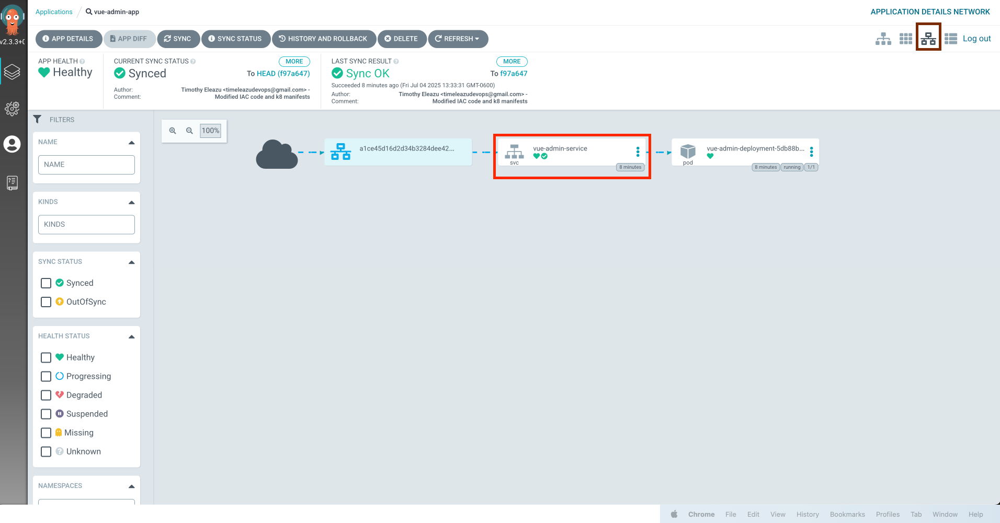
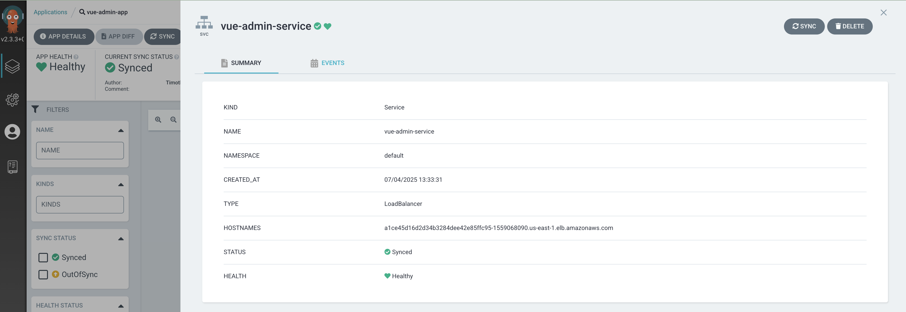

# Using ArgoCD & Terraform to Manage Kubernetes Cluster

### Vue Admin Web App (Kubernetes + ArgoCD)

This project contains the Kubernetes deployment configuration for the Vue Admin frontend application. It is configured for GitOps using ArgoCD. The application is found at `/vue-web-app`

## 🚀 Deployment Overview
The Vue app is containerized and deployed to an EKS cluster via Kubernetes manifests located in the `manifests/` directory. ArgoCD watches this directory and automatically syncs changes to the cluster.


## Steps 
```
terraform init
terraform plan -var-file-terraform.tfvars
terraform apply -auto-approve
```

## Outputs
- `argocd_initial_admin_secret =** "kubectl -n argocd get secret argocd-initial-admin-secret -o jsonpath="{.data.password}" | base64 --decode"`

- `argocd_server_load_balancer = "a53a6bf4abebe46f79da6179425ca5f4-7d359c1121a50305.elb.eu-west-1.amazonaws.com`

- `eks_connect = "aws eks --region eu-west-1 update-kubeconfig --name main-eks-cluster"`

## Connect to k8 Cluster
```
aws eks --region eu-west-1 update-kubeconfig --name tac_eks_cluster
```

## Run Application Manifests
```
kubectl apply -f argocd-app.yaml 
```





